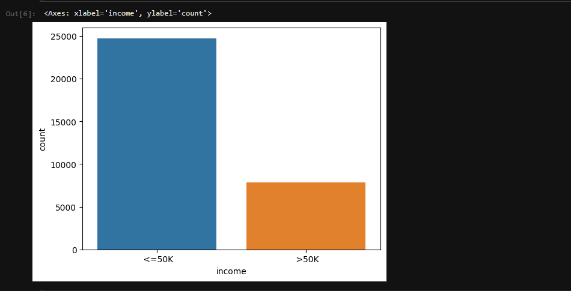

# Tratando Dados Desbalanceados

O tratamento de dados desbalanceados é uma etapa crítica ao lidar com conjuntos de dados em que as classes de interesse têm distribuições muito diferentes. Em problemas de classificação, por exemplo, quando uma classe tem muito mais exemplos do que outra, o modelo pode ficar enviesado em direção à classe majoritária, levando a um desempenho inferior na classe minoritária.

